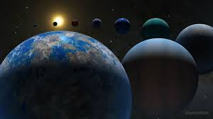
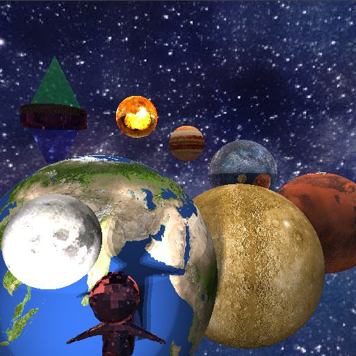

# Proyecto 2:
## Contexto
Se trató de desarrollar un RayTracer de manera que se implementaron diferentes clases para desarrollarlo en python, sin embargo, los tiempos de ejecución fueron extremadamente largos, por ende, se intentó paralelizar pero no se pudo debido al lenguaje.

## Historia de la imagen
Se creó una imagen pensando en cómo se verían los planetas alineados, así mismo, se propuso que la estrella madre, el sol estuviera compuesto de dos triángulos y que esta estrella fuera opaca debido a que ya estaría en sus últimos momentos de vida.
Así mismo, en la parte superior derecha se puede observar una especie de mancha amarillenta, y es que en este plano extraterrestres estarían llegando al sistema solar a conquistarla, y en la parte inferior izquierda estaría un cilindro simulando una especie de agujero de gusano de dónde estaría saliendo un astronauta que proviene del pasado para cambiar la historia.

## Imagen 2_1:
Esta imagen está basada en la imagen base.jpeg que fue obtenida de google:

Así mismo, quedó de esta forma:

Se le añadieron light points para darle otra estética, así mismo, el sol se modificó y se dieron nuevos materiales, además que se añadió un astronauta.

## Links de chat:

Para intentar implementar threads (no se puede por GLI), generar el algoritmo de ray intercept para triángulos y cilindros: https://chat.openai.com/share/97a78ecd-f492-43c9-8cca-fbf0da3556d7
